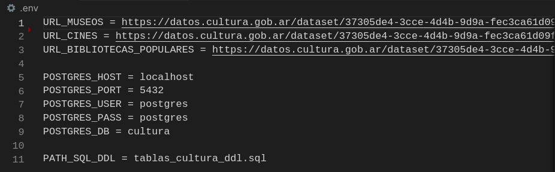

# Datos de Cultura  
Procesamiento, limpieza, normalizacion y almacenamiento en una base de datos __postgresql__ de tablas generadas con __python__ a travez de diversos csv con informacion de establecimientos culturales en la Republica Argentina.

##  Objetivo: Tabla 1
> Normalizar toda la información de los 3 csv: Museos, Salas de Cine y Bibliotecas
Populares, en una unica tabla con las siguientes columnas: 
* cod_localidad
* id_provincia
* id_departamento
* categoría
* provincia
* localidad
* nombre
* domicilio
* código postal
* número de teléfono
* mail
* web

##  Objetivo: Tabla 2
> Procesar los datos conjuntos para poder generar una tabla con la siguiente
informacion:
* Cantidad de registros totales por categoría
* Cantidad de registros totales por fuente
* Cantidad de registros por provincia y categoría  
*(*1)*, *(*2)*

## Objetivo: Tabla 3
> Procesar la información de cines para poder crear una tabla que contenga:
* Provincia
* Cantidad de pantallas
* Cantidad de butacas
* Cantidad de espacios INCAA  
*(*3)*

## Entorno 
Este proyecto fue desarollador y testeado en una plataforma linux (ubuntu), todos los comandos descriptos en el README son para dicha plataforma.

## Preparacion del proyecto
### __Lenguajes__
`sudo apt update`  
Postgresql  
`sudo apt-get install postgresql`  
Python3  
`sudo apt-get install python3`  

### __Entorno virtual__
`sudo apt-get install python3-pip`  
`pip3 install virtualenv`  
`python3 -m venv cultura`  
`source cultura/bin/activate`  

### __Librerias necesarias__
Ejecute el requiements.txt

`pip3 install -r requiements.txt`

### __Configurar la conexion a la base de datos PostgreSQL__
> Debido a que no existen credenciales que ocultar, este repositorio descarga como archivo oculto su .env en ella podra modificar las variables de entorno para las credeciales necesarias para la conexion a la bd postgresql que prefiera.  

*modifique las variables de entorno POSTGRES_* 

En caso de que las url sean modificadas en un futuro, debera cambiarlas de la forma correspondiente.

## Ejecucion del proyecto
Una vez todo instalado, el directorio raiz del repositorio ejecute:
`python3 main.py`
al finalizar la ejecucion habra un archivo debug.log creado que inforara la etapas de ejecucion o donde fallo.  

Si desea ejecutar solamente el script sql __tablas_cultura_ddl.sql__ ejecute:
`python3 conexionDB.py`

## Discusion  
1. Tranquilamente toda la informacion podria quedar almancenada en una tabla de una sola fila, su largo dependera de la cantidad de fuentes y provincias, pero si se llegara a agregar otra fuente en el futuro, el script sql *tablas_cultura_ddl.sql* deberia ser modificado para poder contemplar esa nueva columna. Ademas a nivel de base de datos una tabla con una sola fila es ruidoso, por lo que procedi a generar una tabla desnormalizada producto de un producto cartesiano, mas informacion en el segudo docstring de main.py

2. Se crearon 3 vistas dentro de la base de datos cultura, con el fin de obtener la informacion mencionada como objetivo de la tabla 2:
    * `select * from tablas_cultura.cantidad_registros_categoria;`
    * `select * from tablas_cultura.cantidad_registros_fuente;`
    * `select * from tablas_cultura.cantidad_registros_prov_categ;`

3. La cantidad de asientos, pantallas y espacios incca se cuentan en cantidad de las provincias, en particular la columna espacio incca informa de la cantidad de cines en la provincia que contienen espacios incca.

Ante cualquier consulta, posible mejora o discusion, dejenme un comentario. 